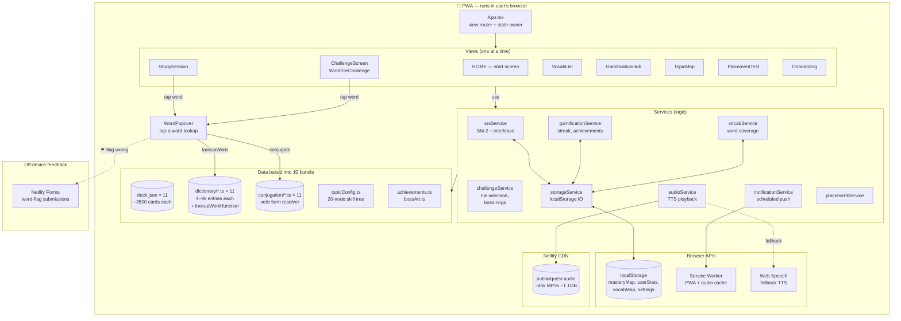

# LangLab — Architecture & Data Pipeline

## A. Runtime Architecture (what runs in the user's browser)



### What lives where

| Layer | Purpose | Notable files |
|-------|---------|---------------|
| **App.tsx** | Single source of truth for `view`, `session`, `settings`, `userStats`, `masteryMap`, `vocabMap`. Orchestrates all view transitions. | `src/App.tsx` (~1500 lines) |
| **Views** | Pure UI; receive props + dispatch via callbacks. No localStorage access of their own. | `src/components/*.tsx` |
| **Services** | All side-effecting logic — SRS scheduling, challenge construction, achievement detection, persistence | `src/services/*.ts` |
| **Data (bundled)** | Decks, dictionaries, conjugation engines — frozen at build time, no runtime fetching | `src/data/{lang}/`, `src/data/dictionary/` |
| **Persistence** | Per-language localStorage keys; migrated by `migrateStorageKeys` on app boot | `storageService.ts` |
| **Audio** | Pre-generated MP3s served from Netlify CDN; falls back to Web Speech API if missing | `public/quest-audio/`, `audioService.ts` |

### Key runtime flow — answering a card

```
User taps card
   ↓
StudySession.tsx sees `q` (quality 0-5)
   ↓
App.handleAnswer()
   ↓
srsService.handleAnswerLogic()  ← SM-2 calculates next interval
   ↓
srsService.saveCardProgress()  ← writes masteryMap to localStorage
   ↓
gamificationService.recordAnswer() ← streak, XP
   ↓
challengeService.selectTileCandidates() ← 5 cards build a boss tile
   ↓
shouldTriggerChallenge() → if true, switch view to CHALLENGE
   ↓
After challenge: calculateBossRing() → tier S/A/B/C/D
   ↓
Back to StudySession with next card from queue
```

---

## B. Data Pipeline (how cards & dicts were *created*)

This is the offline pipeline that produced the data baked into the bundle. Everything in the upper half of (A) was generated and refined by these scripts.

```mermaid
flowchart TB
    subgraph Phase1["Phase 1 — Initial Card Authoring"]
        TPL[Manual templates<br/>per-language generators<br/>e.g. generate-russian-deck.cjs]
        TPL -->|"35 nodes × ~110 cards<br/>each = ~3933 cards"| RAWDECK[(raw deck.json<br/>target + english<br/>+ grammar tip)]
    end

    subgraph Phase2["Phase 2 — Dictionary Build"]
        RAWDECK --> EXTRACT[generate-dictionary.cjs<br/>tokenize every card,<br/>extract unique words]
        EXTRACT --> RAWDICT[(raw dict<br/>word → en stub)]
        RAWDICT --> CLEAN[clean-rebuild-v2.cjs<br/>add types, lemmas,<br/>verb maps]
        CLEAN --> DICT[(dictionary/*.ts<br/>typed entries)]
    end

    subgraph Phase3["Phase 3 — NLP Enrichment"]
        DICT --> STANZA[nlp-qc.py<br/>Stanford Stanza]
        STANZA --> NLPDATA[(nlp-qc-results.json<br/>per-token POS, lemma)]
        NLPDATA --> CROSSREF[nlp-cross-ref.cjs<br/>propagate lemmas,<br/>verb POS detection]
        CROSSREF -->|writes back| DICT
    end

    subgraph Phase4["Phase 4 — IPA"]
        DICT --> IPA[generate-{lang}-ipa.cjs<br/>fill phonetic strings]
        IPA -->|writes back| DICT
    end

    subgraph Phase5["Phase 5 — Audio"]
        RAWDECK --> GTTS[generate-audio.cjs<br/>Google Cloud TTS<br/>Wavenet voices]
        GTTS --> MP3OUT[(public/quest-audio/<br/>*.mp3)]
        RAWDECK -.->|"fallback when<br/>Google billing off"| EDGE[fill-missing-audio.py<br/>Edge TTS Neural]
        EDGE -.-> MP3OUT
    end

    subgraph Phase6["Phase 6 — Quality Audits (recursive)"]
        DICT --> AUDIT1[comprehensive-audit.ts<br/>structural — uses<br/>real lookupWord]
        DICT --> AUDIT2[ai-semantic-audit.py<br/>per-entry Claude review]
        DICT --> AUDIT3[ai-card-audit.py<br/>card-level WRONG_TRANS<br/>UNNATURAL detection]
        DICT --> AUDIT4[ai-polysemy-audit.py<br/>completeness check<br/>'are all meanings listed?']
        DICT --> AUDIT5[find-real-missing.ts<br/>tokens not in dict]

        AUDIT1 --> REPORT[(audit-report-<br/>comprehensive.json)]
        AUDIT2 --> AIFIX[(ai-fixes-{lang}.json)]
        AUDIT3 --> CARDFIX[(ai-card-issues-<br/>{lang}.jsonl)]
        AUDIT4 --> POLYFIX[(ai-polysemy-<br/>{lang}.json)]
        AUDIT5 --> AIGEN[ai-generate-missing.py]
        AIGEN --> MISSFIX[(ai-missing-{lang}.json)]
    end

    subgraph Phase7["Phase 7 — Fix Application (Parse → Edit → Write)"]
        AIFIX --> APPLY1[apply-ai-fixes.cjs]
        CARDFIX --> APPLY2[apply-card-fixes.cjs<br/>+ ai-deck-fix.py for<br/>english field]
        POLYFIX --> APPLY3[apply-polysemy-fixes.cjs]
        MISSFIX --> APPLY4[apply-missing-entries.cjs]
        APPLY1 -->|vm.runInNewContext| DICT
        APPLY2 -->|writes back| DICT
        APPLY2 -->|writes back| RAWDECK
        APPLY3 -->|writes back| DICT
        APPLY4 -->|writes back| DICT

        FIXVERB[fix-verb-clauses.cjs<br/>pos:v → pos:phrase<br/>for clauses with subject]
        FIXVERB -->|writes back| DICT

        MANUAL[manual-bill-fixes.json<br/>apply-manual-fixes.cjs<br/>fallback for AI-missed gaps]
        MANUAL -->|writes back| DICT
    end

    subgraph Phase8["Phase 8 — Build & Deploy"]
        DICT --> VITE[vite build]
        RAWDECK --> VITE
        MP3OUT --> NETLIFY[Netlify CDN]
        VITE --> DIST[(dist/<br/>~15MB JS)]
        DIST --> NETLIFY
    end

    Phase6 -.->|iterate until<br/>thresholds met| Phase6
```

### Pipeline statistics (current state, 2026-04-28)

| Stage | Output | Volume |
|-------|--------|--------|
| Initial generation | 11 deck.json | 38,500 cards total |
| Dictionary build | 11 dict.ts | ~67,000 entries total |
| NLP enrichment | nlp-qc-results | ~250k tokens analyzed |
| Audio | quest-audio/*.mp3 | ~45,000 files, 1.1 GB |
| Audit cycles | reports + fixes | ~22,500 changes applied so far |
| Build | dist/ | 15 MB JS, 251 KB CSS |

### Design patterns the pipeline relies on

**1. Parse → Edit → Write (never regex on .ts source)**
Every "apply fixes" script uses the same dance: `splitFile()` finds the dict literal, `vm.runInNewContext('({' + body + '})')` parses it as a JS object, the script edits the object, `serializeDict()` writes it back. This is robust against odd characters in source words (apostrophes, Cyrillic, Devanagari, etc.) because we never touch the raw text.

**2. Resume by side effect**
Long audits (`ai-card-audit.py`, `ai-polysemy-audit.py`) write incremental progress to `*-{lang}.jsonl`/`.json` after every 5 batches. On rerun, they skip entries already in the file. Lets us tolerate API rate limits and Ctrl-C without losing work.

**3. Card-centric vs Dict-centric audits**
`ai-card-audit.py` walks deck → dict (does the entry match how this card uses it?). `ai-polysemy-audit.py` walks dict → reality (does the entry list all common meanings of this word?). Both are needed — the bill/check polysemy bug existed because the first kind of audit can't see meanings the deck doesn't exemplify.

**4. Real `lookupWord` everywhere**
The audit pipeline imports the actual production `lookupWord(...)` from each dictionary file. So if hyphen handling, elisions, or verb form resolution change, audits automatically reflect what the user sees. No regex re-implementations of lookup logic.

**5. Stanza as ground truth, not gospel**
Stanza's POS/lemma analysis seeds the dictionary but is treated as a hint — discrepancies between Stanza and our dict become `STANZA_LEMMA_MISMATCH` audit issues, not silent overwrites. Many are legitimate (e.g. `frage` Stanza picks `abfragen` but `fragen` is more common — both are kept).

---

## C. How the two halves connect

The runtime app **never calls** any of the pipeline scripts. The pipeline produces frozen artifacts (`.ts`, `.json`, `.mp3`) which Vite bundles into `dist/`. The app gets the *result*; the user's phone doesn't run Stanza or Claude.

If a user taps "⚑ flag as wrong" inside `WordPopover`, the issue goes to **Netlify Forms** (a separate channel). It's then a manual review step that may feed the next pipeline iteration — but that's a human-in-the-loop step, not an automated one.

---

## Where to look for X

| If you want to… | Look at |
|------------------|---------|
| Understand a card's lifecycle | `srsService.ts` (handleAnswerLogic, interleaveQueue) |
| See how a tap-on-word works | `WordPopover.tsx` → `dictionary/{lang}.ts::lookupWord` → `conjugation/{lang}.ts` |
| Trace a localStorage value | grep `storageService.ts` for the key |
| Add a meaning to a word | `manual-bill-fixes.json` + `node scripts/apply-manual-fixes.cjs` |
| Re-run the full audit cycle | `scripts/AUDIT_SUMMARY.md` (step-by-step recipe) |
| Generate a new language | walk Phase 1 → 5 of the pipeline; the per-lang `generate-*-deck.cjs` is the template |
